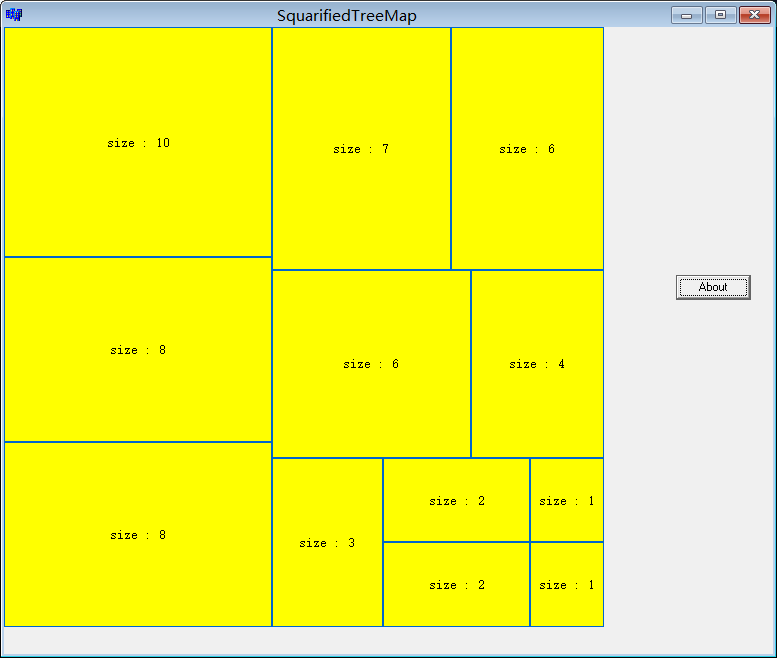
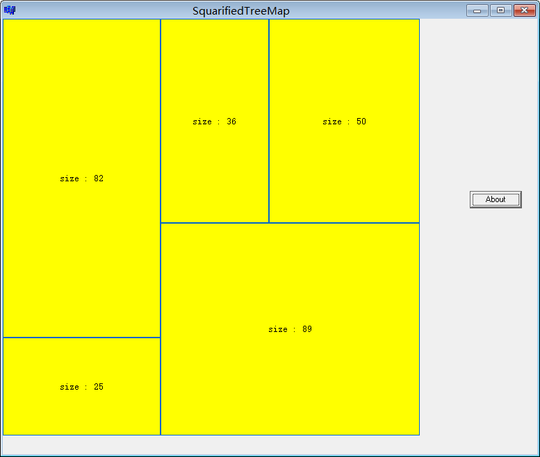
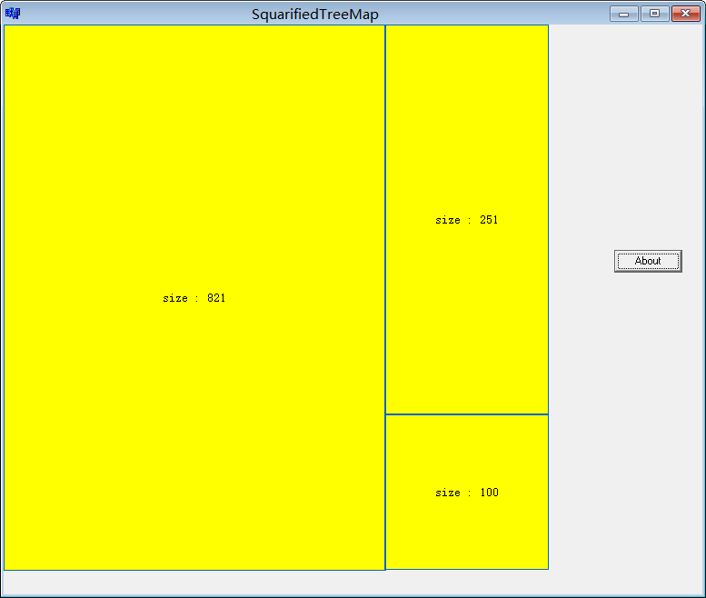

# SquarifiedTreeMap
A sample implement of squarified tree map, based on C++ Bulider 6, coded by C++.

## Sample
The sample consist of three test.
###test01
test data: 10, 8, 8, 7, 6, 6, 4, 3, 2, 2, 1, 1

###test02
test data: 82, 25, 36, 50, 89

###test03
test data: 821, 251, 100

